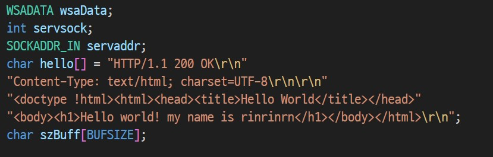
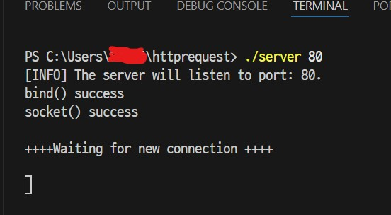
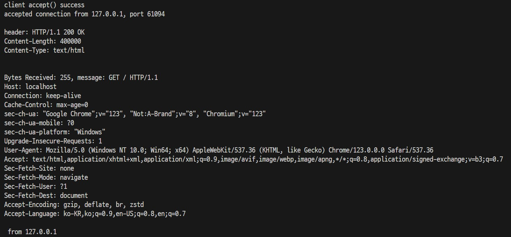
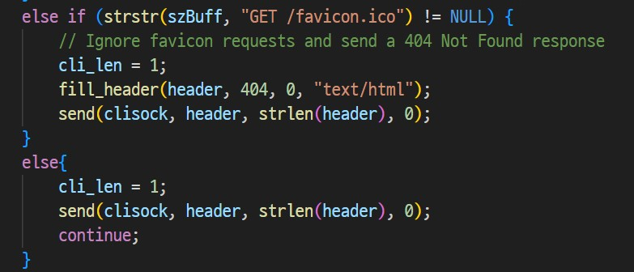

# Cloud Computing WebServer Homework
모바일시스템공학과 32217259 문서영

> [목차]
> 1. 개요
> 2. 개념
> 3. 코드 설명
> 4. ChatGPT 사용한 부분
> 5. 어려웠던 점&후기
---

## 1. 개요
이번 과제는 aws를 사용하여 서버를 구축하기 전에 socket API를 사용하여 웹서버를 만드는 프로젝트입니다. 
포트 80번을 열어 기본 웹페이지를 확인하고, index.html을 만들어 오픈하는 작업을 하였습니다. 이를 통해서 socket programming에 대해 알아보고, HTTP GET를 확인할 수 있었습니다.
언어는 C언어로 작성하였고, 환경은 리눅스, 윈도우 중에 윈도우를 선택했습니다.

---
## 2. 개념
### 1. TCP/IP socket programming (int Window)    


      1. server와 client의 소켓을 생성한다.
      2. server의 주소를 socket에 묶는다.(bind)
      3. client는 서버에 접속(connect)하여 데이터를 보낸다(send)
      4. server는 먼저 실행하여 client가 접속하기를 기다린다.(listen)
      5. server는 client 접속을 수용하고(accept), client가 보낸 데이터를 받아(recv) 처리한다.
      6. 처리한 데이터를 client에게 보낸다.(send)
      7. 데이터를 주고받는 과정을 모두 마치면 접속을 끊는다.(closesocket)
      
      [출처: https://www.geeksforgeeks.org/tcp-server-client-implementation-in-c/]

### 2. HTTP

- HTTP

  **HTTP(HyperText Transfer Protocol)** 는 웹  W3(WWW, World Wide Web) 상에서 정보를 주고받을 수 있는 프로토콜로 주로 HTML 문서를 주고받는 데에 쓰입니다.
  주로 TCP의 80번 포트를 사용합니다. <br>
  **이번에 사용할 프로토콜도 TCP이며, 80번 포트를 사용합니다.** <br><br>
  Client와 Server 사이에 이루어지는 Request/Response 프로토콜로, client인 윕 브라우저가 http를 사용해 정보를 요청하면, server는 요청에 답하여 정보를 사용자에게 전달합니다.
  <br> [출처: https://ko.wikipedia.org/wiki/HTTP ]

- Request message
http request message는 공백(Blank Line)을 제외하고 Start Line, Headers, Body 이렇게 3가지 부분으로 나눌 수 있다.

  

    - Start Line: 요청에 대한 정보를 담는 GET, POST 등이 있습니다. GET은 존재하는 정보에 대한 요청, POST는 새로운 정보 생성과 같은 기능이 있습니다.
    - Headers: 요청에 대한 설명, 메세지 본문에 대한 추가적인 설명이 포함되어 있습니다. (Host, User-agent, Referer, Accept, Authorization, Origin, Cookie)
    - Body: Blank Line 뒷쪽으로 이어지며, HTTP Request가 전송하는 데이터를 담고 있습니다. 만약 전송하는 데이터가 없다면 이 부분은 비어있습니다. (보통 POST 요청일 때, HTML 폼 데이터가 포함되어 있습니다.)
     <br> [출처: https://hahahoho5915.tistory.com/62 ]

---
## 3. 코드 설명 및 실행
1. 헤더 부분
    ```
    #include <stdio.h>
    #include <winsock2.h>
    
    #pragma comment(lib, "ws2_32.lib") //Winsock Library
    ```

2. 변수 초기화



  윈도우에서는 socket을 생성하기 전에 윈속(WSADATA)을 함께 넣어줘야 합니다. 소켓 생성(int로 생성)과 server의 주소를 설정합니다.(SOCKADDR_IN) 또한 client로 잘 보내졌다면 전송될 데이터(hello)와 실제로 client로 전송할 데이터 버퍼(szBuff)를 만들어 주었습니다.

4. port, socket 설정
port는 직접 입력하도록 설정하였습니다.
socket에서 주소 패밀리는 IPv4로 설정하였고, protocol type은 TCP(SOCK_STREAM), protocol은 기본값으로 초기화하고, 주소값도 이와 같이 설정하였습니다. 

5. bind, listen
bind: 위에서 만든 소켓에 소켓 주소를 넣는 작업을 하였고, 만약 오류가 발생하면 오류 메세지를 출력하도록 했습니다.
lisen: server 소켓의 모드를 변경하여 client의 접속을 기다립니다. 만약 socket이 가득 차면 오류 메세지를 보내도록 합니다.



  만약 요청을 성공하게 된다면 success 메세지를 출력하고 client가 접속할 때까지 연결을 기다립니다.


6. (-1) accept, recv, send
accept: accept 작업을 하기 위해 client socket을 만들고, client의 응답을 계속 받도록 while문을 사용하였습니다. accept를 함으로써 client에 연결할 준비를 끝냅니다. 
recv: client로 데이터를 보낼 준비를 합니다. 
send: client socket으로 미리 입력한 데이터(hello)를 보냅니다.


  

  만약 웹으로 잘 보내졌다면, HTTP 성공 메세지와 함께 정보를 보여줍니다.

  - header: HTTP 요청 성공 여부
  - Content-Length: 받을 수 있는 buffer 사이즈
  - Content-Type: 데이터 타입
  - Bytes Recevied: 실제 client가 받은 byte 수
  - message(szBuff)
        <br>: request method, host, connection, cach-control, sec-ch-ua-mobile, sec-ch-ua-platform, Upgrade-Insecure-Requests, User-Agent,
    Accept, Sec-Fetch-Site, Sec-Fetch-Mode, Sec-Fetch-User, Sec-Fetch-Dest, Accept-Encoding, Accept-Language
  - 127.0.0.1: client address


5. (-2) index.html open하기
html 파일을 작성 후 경로를 추가해 여는 작업을 추가해 보았습니다. 
index.html이 만약 존재하고 요청했다면, 파일을 읽도록 합니다.

5. (-3) 추가 요청



webserver에서 새로고침을 하지 않아도 끊임없이 요청되어 확인해보니, '''GET /favicon.ico''' 로 정보가 수정되어 출력되어 이를 없애기 위해 if문을 추가로 사용했고, 위의 요청을 수정해도 똑같은 오류가 발생하여 만약 요청을 받지 않는다면, 아무것도 받지 않고 되돌아가도록 수정하였습니다.


6. close socket
통신을 마치면 소켓과 윈속을 종료합니다.


---
## 4. ChatGPT 사용한 부분

  - 5-3의 추가 요청을 ChatGPT에게 물어봐 수정하였습니다.
  - index.html을 추가하는 방법을 물어보았습니다.

---
## 5. 어려웠던 점&후기

소켓 프로그래밍을 구현해본 적이 없기도 하고, 그동안 프로그래밍을 구현하고 콘솔창에만 출력되도록 하는 방법 밖에 해본 적이 없었는데, 이렇게 웹서버와 연결하여 구현하려고 하니 프로그래밍 외의 네트워크에 대한 지식도 필요하여 어려웠습니다.
또한 화면에 html을 출력하는 건 chatGPT를 적게 사용하고도 만들 수 있었는데, 새로 웹페이지를 붙이는 작업은 파일 입출력을 같이 사용하다보니 더 오래 걸렸던 것 같습니다.  

컴퓨터 네트워크 과목에서 HTTP와 TCP/UDP에 대한 정보를 배워 알고는 있었지만, 알고 있는 것과 실제로 만들어보는 것에는 큰 차이가 있었습니다. 그래서 ChatGPT의 힘을 많이 빌렸는데, 다음 번에는 최대한 스스로 소켓 프로그래밍을 구현해볼 수 있도록 연습해야겠다는 생각을 하게 되었습니다. 